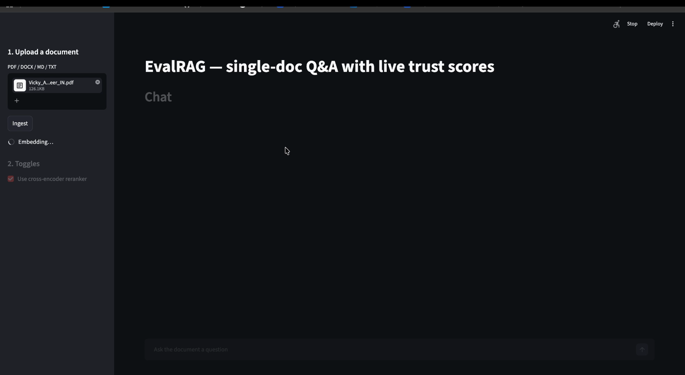
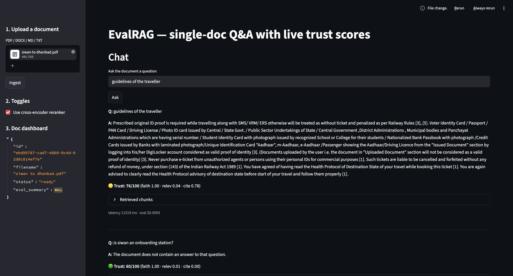

# EvalRAG

Single-doc RAG with live trust scores and auto-generated eval sets. See `docs/superpowers/specs/2026-05-01-evalrag-design.md`.



## Demo

[](docs/videos/evalrag_demo.mp4)

**[Watch the 47-second demo video](docs/videos/evalrag_demo.mp4)**

The demo shows document upload, hybrid retrieval, citation-grounded answering,
live trust scoring, and retrieved evidence inspection.

## Prerequisites
- Python 3.12
- PostgreSQL 16 with [pgvector](https://github.com/pgvector/pgvector) installed locally
- A user `evalrag` and database `evalrag` (see "Postgres setup" below)

## Quick start
1. `cp .env.example .env` — fill in `GEMINI_API_KEY` or `OPENAI_API_KEY`; adjust `DATABASE_URL` if your Postgres differs
2. `make install` — creates `.venv` with Python 3.12 and installs dependencies
3. `make migrate`
4. `make api` (terminal 1) and `make ui` (terminal 2)

## Postgres setup (one-time)
```bash
psql -h localhost -U postgres -d postgres -c "CREATE USER evalrag WITH PASSWORD 'evalrag' SUPERUSER;"
psql -h localhost -U postgres -d postgres -c "CREATE DATABASE evalrag OWNER evalrag;"
psql -h localhost -U postgres -d evalrag    -c "CREATE EXTENSION vector;"
```
If pgvector isn't packaged for your Postgres install, build from source against your `pg_config` — see https://github.com/pgvector/pgvector#installation.

## Demo run

1. Ensure Postgres is running with the `evalrag` user/db and `vector` extension (see "Postgres setup").
2. `make install` — create `.venv` if needed and install deps into it.
3. `make migrate` — apply migrations (creates 5 tables + ts_vec trigger).
4. `make api` (terminal 1) — boots FastAPI on port 8000.
5. Drop a PDF/DOCX/MD/TXT at `evals/canonical.pdf`, then `python scripts/seed_demo_doc.py` (terminal 2). Capture the `id` from the JSON output — that's the `doc_id`.
6. `make ui` (terminal 3) — open http://localhost:8501.
7. Ask a question; toggle reranker off; observe trust score drop.
8. `python scripts/run_regression.py <doc_id>` — run L3 regression. Outputs to `evals/results/<git_sha>.json`. If `evals/baseline.json` exists, prints deltas; trust regression > 2 points fails the run.

## Eval layers

- **L1** — every `/query` answer carries `trust_score: {overall, band, breakdown}`. Composite of faithfulness (LLM-as-judge, GPT-4o-mini cross-family) + context relevance + citation coverage. Computed live, ~500 ms overhead.
- **L2** — auto-generated Q&A per uploaded doc (30 stratified + 5 adversarial), validated by a second LLM pass, evaluated against the system. Persisted in `eval_runs` (layer="L2") and `Doc.eval_summary`. Triggered as a FastAPI BackgroundTask after upload.
- **L3** — hand-curated 30-Q&A regression set in `evals/regression_set.jsonl`. Runner at `scripts/run_regression.py`. CI gate: trust regression > 2 points fails.

## Layout

```
src/evalrag/
├── api/             # FastAPI app + routes
├── core/
│   ├── ingest/      # loader, chunker, embedder
│   ├── retrieval/   # vector_store, bm25_index, retriever, reranker, query_transformer
│   ├── generation/  # prompts, generator (Claude Sonnet 4.6)
│   └── eval/        # trust_scorer (L1), golden_generator (L2), evaluator, regression_runner (L3), orchestration
├── observability/   # structlog tracer
├── storage/         # SQLAlchemy models + db
└── ui/              # Streamlit
```
